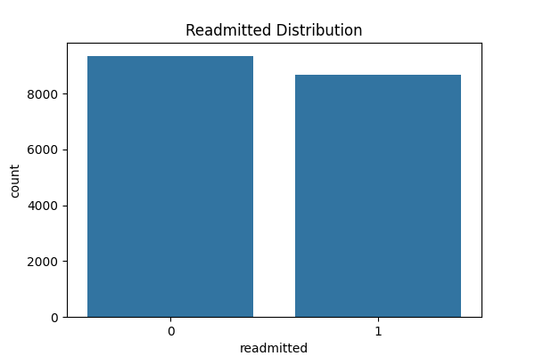
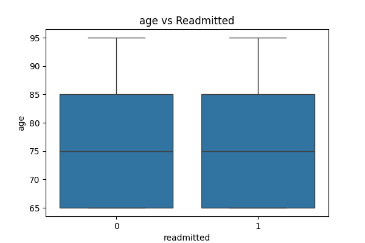
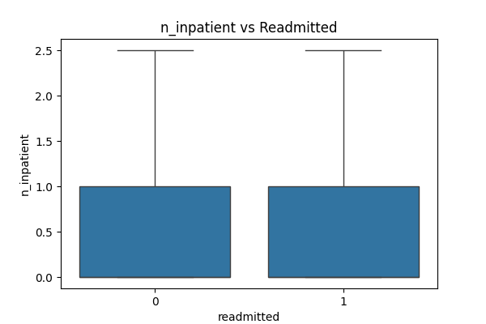
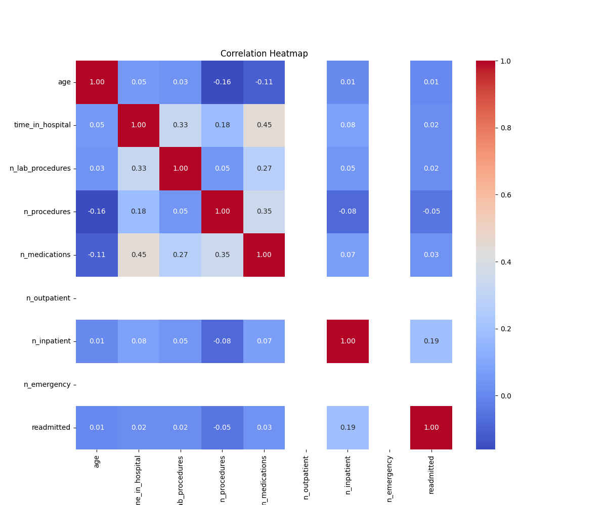
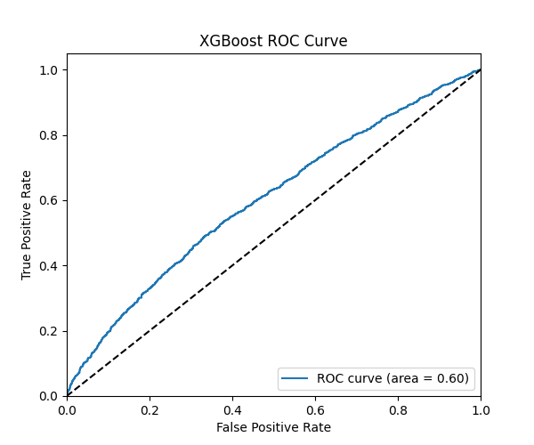
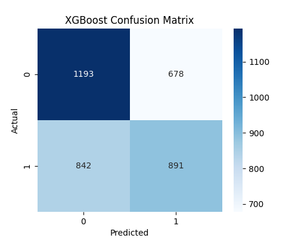
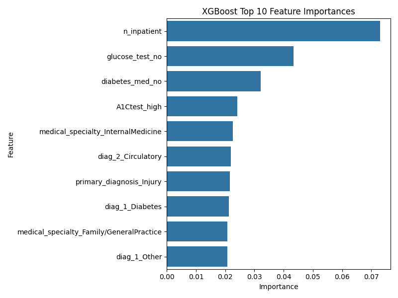
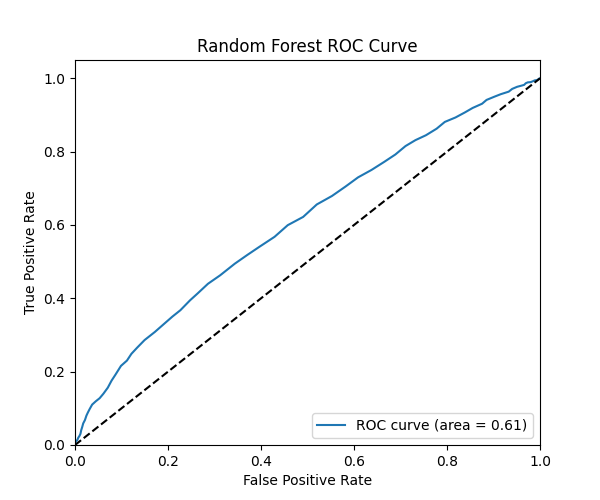
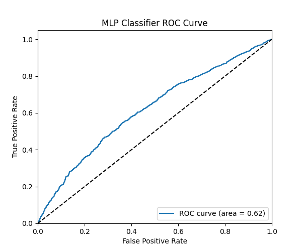

# Predictive Health Monitoring for Aged Care

A full-stack machine learning project to predict hospital readmission risk for aged care patients (60+), featuring:
- Data preprocessing and feature engineering
- Exploratory Data Analysis (EDA)
- Multiple ML models (Logistic Regression, Random Forest, XGBoost, MLP)
- Model comparison and evaluation
- FastAPI backend for inference
- React frontend for user-friendly predictions

---

## Project Structure

```
.
├── Data pipeline/           # Preprocessing scripts
├── Dataset/                 # Raw and processed data
├── models/                  # Saved ML models
├── report/                  # EDA images, model results
├── Deployment/
│   ├── backend/             # FastAPI backend
│   └── frontend/            # React frontend
└── README.md                # (This file)
```

---

## 1. Data Preprocessing & EDA
- Filtered for aged care (60+)
- Mapped age ranges to midpoints
- Handled missing values, outliers, and categorical variables
- One-hot encoding for model input
- EDA: histograms, boxplots, correlation heatmap (see below)

### Example EDA Visualizations

**Readmission Distribution:**


**Age vs. Readmitted (Boxplot):**


**Number of Inpatient Visits vs. Readmitted (Boxplot):**


**Correlation Heatmap:**


---

## 2. Model Training & Evaluation
- Trained Logistic Regression, Random Forest, XGBoost, and MLP
- Saved best models to `models/`
- Evaluation metrics and plots saved in `report/`
- XGBoost performed best after feature engineering and tuning

### Example Model Evaluation Plots

**XGBoost ROC Curve:**


**XGBoost Confusion Matrix:**


**XGBoost Feature Importance:**


**Random Forest ROC Curve:**


**MLP Classifier ROC Curve:**


---

## 3. Deployment
### Backend (FastAPI)
- Serves `/models` (list available models) and `/predict` (make prediction) endpoints
- Loads all trained models at startup
- Located in `Deployment/backend/`

### Frontend (React)
- User selects model, enters patient data, and gets prediction
- Preprocesses input to match model expectations
- Shows result in a modal with a colored circular progress bar
- Located in `Deployment/frontend/`

---

## How to Run

### 1. Backend (FastAPI)
```bash
cd Deployment/backend
pip install -r requirements.txt
uvicorn app:app --reload --host 0.0.0.0 --port 8000
```

### 2. Frontend (React)
```bash
cd Deployment/frontend
npm install
npm start
```
Visit [http://localhost:3000](http://localhost:3000)

---

## Features
- Select from multiple ML models
- User-friendly form for patient data
- Real-time prediction with probability visualization
- All preprocessing handled in the frontend to match model pipeline
- Clear, color-coded results (red for "Readmitted", green for "Not Readmitted")

---

## Requirements
- Python 3.8+
- Node.js 16+
- See `Deployment/backend/requirements.txt` and `Deployment/frontend/package.json`

---

## Credits
Developed by Rashed and AI assistant. For academic and demonstration purposes. 